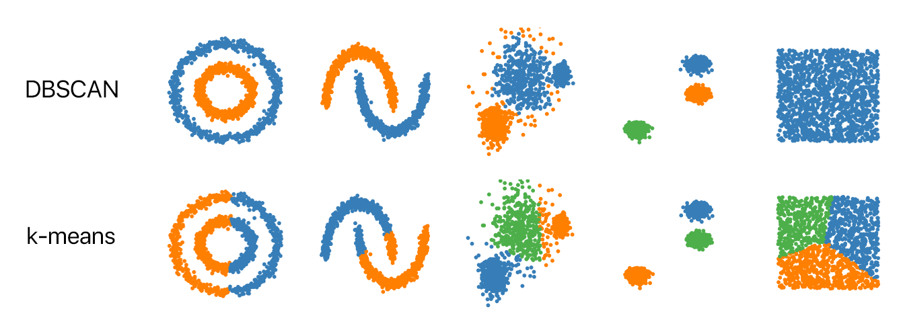

<!--
[![Contributors][contributors-shield]][contributors-url]
[![Forks][forks-shield]][forks-url]
[![Stargazers][stars-shield]][stars-url]
[![Issues][issues-shield]][issues-url]
[![MIT License][license-shield]][license-url]
[![LinkedIn][linkedin-shield]][linkedin-url]
 -->


<!-- PROJECT LOGO -->
<br />
<h3 align="center">DBSCAN from scratch</h3>
<p align="center">(Density Based Spatial Clustering of Applications with Noise)</p>
<p align="center">
  <a href="https://executive-education.dauphine.psl.eu/formations/executive-master-diplome-universite/ia-science-donnees" target="_blank">
    
  </a>


<!-- TABLE OF CONTENTS -->
<details open="open">
  <summary><h2> Table of Contents</h2></summary>
  <ol>
    <li>
      <a href="#about-the-project">About The Project</a>
      <ul>
        <li><a href="#description">Description</a></li>
      </ul>
      <ul>
        <li><a href="#datasets">Datasets</a></li>
      </ul>
    </li>
    <li>
      <a href="#getting-started">Getting Started</a>
      <ul>
        <li><a href="#prerequisites">Prerequisites</a></li>
        <li><a href="#installation">Installation</a></li>
      </ul>
    </li>
    <li><a href="#usage">Usage</a></li>

  </ol>
</details>


<!-- ABOUT THE PROJECT -->
## About The Project
  
DBSCAN is a non-parametric density-based clustering algorithm. Given a set of points in some space, it groups together points
that are closely packed together (points with many nearby neighbors), marking as outliers points that lie alone in low-density
regions (whose nearest neighbors are too far away).

DBSCAN succeeds where K-Means fails. More precisely DBSAN is more suitable when:
* the shape of the distribution of each attribute (variable) is not spherical,
* variables have different variances,
* the prior probability for all k clusters are not the same, i.e. each cluster has different number of observations.

<a href="https://executive-education.dauphine.psl.eu/formations/executive-master-diplome-universite/ia-science-donnees" target="_blank">
    
</a>
  
DBSCAN algorithm has proved extremely efficient in detecting outliers and handling noise.

**This project is a example of DBSCAN  algorithm that I implemented from scratch. My main objective was to understand what under the hood and gain a better intuition.**


### Description
<p style='color:red'>Much of the code has been stored in my own package and modules to make the Jupyter Notebook more readable.</p>
The project contains:

```sh
- 1 Jupyter Notebooks as the main files:
	* DBSCAN.ipynb
	
- 1 package: mypackage
	* module : clustering.py	
	* module : ploter.py

- 1 Docker File for building a docker container:
	* Dockerfile.txt	
```

<a href="https://github.com/DanielOmola/Data_Science_Portfolio/tree/main/DBSCAN_From_Scratch" target="_blank">Project Link</a>
	

### Datasets
Some simulated Data.

<!-- GETTING STARTED -->
## Getting Started


### Prerequisites
*  Python3
*  Jupyter Notebook
*  Pandas
*  Numpy
*  Plotly

### Installation

If you chose the first installation method, make sure the prerequisites are available in your system.

#### Method - 1
1. Clone the repo
```JS
   git clone https://github.com/DanielOmola/Data_Science_Portfolio/tree/main/DBSCAN_From_Scratch
```
2. Open one of the file below in Jupyter Notebook
```JS
   DBSCAN.ipynb
```
<!-- -->

#### Method - 2
(the easiest way if docker is already installed in your system)

1. Clone the repo
```JS
   git clone https://github.com/DanielOmola/Data_Science_Portfolio/tree/main/DBSCAN_From_Scratch
```
2. Open the terminal and move to the cloned directory 
```JS
   cd PATH/TO/THE/DIRECTORY
```
3. Create a Docker image from the terminal
```JS
   docker build . --no-cache=true -f Dockerfile.txt -t dbscan
```
4. Run the Docker image
```JS
 docker run -it -p 8888:8888 dbscan
```


<!-- USAGE EXAMPLES -->
## Usage

Play with it as you want.


<!-- CONTACT -->
## Contact

Daniel OMOLA - daniel.omola@gmail.com


<!-- Recommended links -->
## Recommended links

* <a href="https://www.youtube.com/watch?v=sKRUfsc8zp4&t=72s" target="_blank">DBSCAN: Part 1</a>
* <a href="https://www.youtube.com/watch?v=6jl9KkmgDIw" target="_blank">DBSCAN: Part 2</a>
* <a href="https://www.geeksforgeeks.org/difference-between-k-means-and-dbscan-clustering/" target="_blank">Difference between K-Means and DBScan Clustering</a>