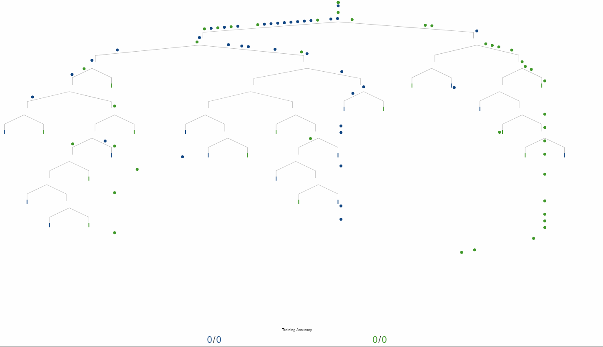

<!--
[![Contributors][contributors-shield]][contributors-url]
[![Forks][forks-shield]][forks-url]
[![Stargazers][stars-shield]][stars-url]
[![Issues][issues-shield]][issues-url]
[![MIT License][license-shield]][license-url]
[![LinkedIn][linkedin-shield]][linkedin-url]
 -->


<!-- PROJECT LOGO -->
<br />
<h3 align="center">Decision Tree Classifier from scratch</h3>
<p align="center">(performance compared with Sklearn implementation)</p>
<p align="center">
  <a href="https://executive-education.dauphine.psl.eu/formations/executive-master-diplome-universite/ia-science-donnees" target="_blank">
    
  </a>


<!-- TABLE OF CONTENTS -->
<details open="open">
  <summary><h2> Table of Contents</h2></summary>
  <ol>
    <li>
      <a href="#about-the-project">About The Project</a>
      <ul>
        <li><a href="#description">Description</a></li>
      </ul>
      <ul>
        <li><a href="#datasets">Datasets</a></li>
      </ul>
    </li>
    <li>
      <a href="#getting-started">Getting Started</a>
      <ul>
        <li><a href="#prerequisites">Prerequisites</a></li>
        <li><a href="#installation">Installation</a></li>
      </ul>
    </li>
    <li><a href="#usage">Usage</a></li>

  </ol>
</details>


<!-- ABOUT THE PROJECT -->
## About The Project
  
A **Decision Tree** is a **supervised algorithm** that **can be viewed as a series of if questions** aim to **predict a numerical
 value** when facing a **regression problem** or **predict a class** when facing a **classification problem**.

The order of if questions/conditions is based on:

* **impurity criteria for classification: GINI or Enthropy**
* **homogeneity criterion for regression: Variance or Standard deviation**	


The algorithms for building trees breaks down a data set into smaller and smaller subsets while an associated decision tree is incrementally developed. The final result is a tree with decision nodes and leaf nodes.
A decision node has two or more branches. Leaf node represents a classification or decision (used for regression).
The topmost decision node in a tree which corresponds to the best predictor (most important feature) is called a root node.

Decision trees can handle both categorical and numerical data. They can handle missing data too.


**This project is an example of Decision Tree Classifier that I implemented from scratch. My main objective was to understand what under the hood and gain a better intuition.
The results are compared with sklearn for consistency.**


### Description
**Much of the code has been stored into my own package and modules to make the Jupyter Notebook more readable.**

The project contains:

```sh
- 1 Jupyter Notebooks as the main files:
	* Decision_Tree_Classifier.ipynb
	
- 1 package: mypackage
	* module : classifier.py
	* module : dataloader.py	
	* module : ploter.py

- 1 Docker File for building a docker container:
	* Dockerfile.txt	
```

<a href="https://github.com/DanielOmola/Data_Science_Portfolio/tree/main/Decision_Tree_Classifier_From_Scratch" target="_blank">Project Link</a>
	

### Datasets
Iris dataset

<!-- GETTING STARTED -->
## Getting Started


### Prerequisites
*  Python3
*  Jupyter Notebook
*  Pandas
*  Numpy
*  Plotly
*  sklearn (for comparaison)

### Installation

If you chose the first installation method, make sure the prerequisites are available in your system.

#### Method - 1
1. Clone the repo
```JS
   git clone https://github.com/DanielOmola/Data_Science_Portfolio/tree/main/Decision_Tree_Classifier_From_Scratch
```
2. Open one of the file below in Jupyter Notebook
```JS
   Decision_Tree_Classifier.ipynb
```
<!-- -->

#### Method - 2
(the easiest way if docker is already installed in your system)

1. Clone the repo
```JS
   git clone https://github.com/DanielOmola/Data_Science_Portfolio/tree/main/Decision_Tree_Classifier_From_Scratch
```
2. Open the terminal and move to the cloned directory 
```JS
   cd PATH/TO/THE/DIRECTORY
```
3. Create a Docker image from the terminal
```JS
   docker build . --no-cache=true -f Dockerfile.txt -t dicision_tree
```
4. Run the Docker image
```JS
 docker run -it -p 8888:8888 dicision_tree
```


<!-- USAGE EXAMPLES -->
## Usage

Play with it as you want.


<!-- CONTACT -->
## Contact

Daniel OMOLA - daniel.omola@gmail.com


<!-- Recommended links -->
## Recommended links

* <a href="https://www.youtube.com/watch?v=7VeUPuFGJHk" target="_blank">StatQuest: Decision Trees</a>
* <a href="https://www.youtube.com/watch?v=wpNl-JwwplA" target="_blank">StatQuest: Decision Trees, Part 2 - Feature Selection and Missing Data</a>
* <a href="https://www.analyticsvidhya.com/blog/2020/10/all-about-decision-tree-from-scratch-with-python-implementation/" target="_blank">All About Decision Tree</a>
