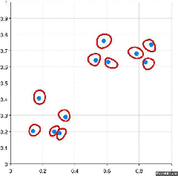

<!--
[![Contributors][contributors-shield]][contributors-url]
[![Forks][forks-shield]][forks-url]
[![Stargazers][stars-shield]][stars-url]
[![Issues][issues-shield]][issues-url]
[![MIT License][license-shield]][license-url]
[![LinkedIn][linkedin-shield]][linkedin-url]
 -->


<!-- PROJECT LOGO -->
<br />
<h3 align="center">Hierarchical clustering from scratch</h3>
<p align="center">(Agglomerative Hierarchical clustering with different linkage methods)</p>
<p align="center">
  <a href="https://executive-education.dauphine.psl.eu/formations/executive-master-diplome-universite/ia-science-donnees" target="_blank">
    
  </a>


<!-- TABLE OF CONTENTS -->
<details open="open">
  <summary><h2> Table of Contents</h2></summary>
  <ol>
    <li>
      <a href="#about-the-project">About The Project</a>
      <ul>
        <li><a href="#description">Description</a></li>
      </ul>
      <ul>
        <li><a href="#datasets">Datasets</a></li>
      </ul>
    </li>
    <li>
      <a href="#getting-started">Getting Started</a>
      <ul>
        <li><a href="#prerequisites">Prerequisites</a></li>
        <li><a href="#installation">Installation</a></li>
      </ul>
    </li>
    <li><a href="#usage">Usage</a></li>

  </ol>
</details>


<!-- ABOUT THE PROJECT -->
## About The Project
  
**Hierarchical cluster analysis** or **HCA** is an unsupervised clustering algorithm which involves creating clusters that have predominant ordering from top to bottom.
The algorithm groups similar objects into groups called clusters. The endpoint is a set of clusters or groups, where each cluster is distinct from each other cluster, and the objects within each cluster are broadly similar to each other.

This clustering technique is divided into two types:

* Agglomerative Hierarchical Clustering
* Divisive Hierarchical Clustering

**Agglomerative Hierarchical Clustering is the most common type of hierarchical clustering** used to group objects in clusters based on their similarity. It’s also known as AGNES (Agglomerative Nesting). It's a “bottom-up” approach: each observation starts in its own cluster, and pairs of clusters are merged as one moves up the hierarchy.
How does it work?

1. Make each data point a single-point cluster → forms N clusters
1. Take the two closest data points and make them one cluster → forms N-1 clusters
1. Take the two closest clusters and make them one cluster → Forms N-2 clusters.
1. Repeat step-3 until you are left with only one cluster.

Have a look at the visual representation of Agglomerative Hierarchical Clustering for better



There are several ways to measure the distance between clusters in order to decide the rules for clustering, and they are often called Linkage Methods. Some of the common linkage methods are:

* **Complete-linkage:** the distance between two clusters is defined as the longest distance between two points in each cluster.
* **Single-linkage:** the distance between two clusters is defined as the shortest distance between two points in each cluster. This linkage may be used to detect high values in your dataset which may be outliers as they will be merged at the end.
* **Average-linkage:** the distance between two clusters is defined as the average distance between each point in one cluster to every point in the other cluster.
* **Centroid-linkage:** finds the centroid of cluster 1 and centroid of cluster 2, and then calculates the distance between the two before merging.

The main output of Hierarchical Clustering is a dendrogram, which shows the hierarchical relationship between the clusters.


**This project is a example of Hierarchical Clustering algorithm that I implemented from scratch. My main objective was to understand what under the hood and gain a better intuition.
The results are compared with Scipy for consistency.**


### Description
<p style='color:red'>Much of the code has been stored in my own package and modules to make the Jupyter Notebook more readable.</p>
The project contains:

```sh
- 1 Jupyter Notebooks as the main files:
	* K_Means.ipynb
	
- 1 package: mypackage
	* module : clustering.py	
	* module : ploter.py

- 1 Docker File for building a docker container:
	* Dockerfile.txt	
```

<a href="https://github.com/DanielOmola/Data_Science_Portfolio/tree/main/Hierarchical_Clustering_From_Scratch" target="_blank">Project Link</a>
	

### Datasets
Simulated Data and sklearn data sets.

<!-- GETTING STARTED -->
## Getting Started


### Prerequisites
*  Python3
*  Jupyter Notebook
*  Pandas
*  Numpy
*  Scipy  (for comparaison)
*  matplotlib

### Installation

If you chose the first installation method, make sure the prerequisites are available in your system.

#### Method - 1
1. Clone the repo
```JS
   git clone https://github.com/DanielOmola/Data_Science_Portfolio/tree/main/Hierarchical_Clustering_From_Scratch
```
2. Open one of the file below in Jupyter Notebook
```JS
   Hierarchical_Clustering.ipynb
```
<!-- -->

#### Method - 2
(the easiest way if docker is already installed in your system)
1. Clone the repo
```JS
   git clone https://github.com/DanielOmola/Data_Science_Portfolio/tree/main/Hierarchical_Clustering_From_Scratch
```
2. Open the terminal and move to the cloned directory 
```JS
   cd PATH/TO/THE/DIRECTORY
```
3. Create a Docker image from the terminal
```JS
   docker build . --no-cache=true -f Dockerfile.txt -t hclustering
```
4. Run the Docker image
```JS
 docker run -it -p 8888:8888 hclustering
```


<!-- USAGE EXAMPLES -->
## Usage

Play with it as you want.


<!-- CONTACT -->
## Contact

Daniel OMOLA - daniel.omola@gmail.com


<!-- Recommended links -->
## Recommended links

* <a href="https://www.youtube.com/watch?v=7xHsRkOdVwo" target="_blank">StatQuest: Hierarchical Clustering</a>
* <a href="https://www.youtube.com/watch?v=EUQY3hL38cw" target="_blank">Hierarchical Clustering - Fun and Easy Machine Learning</a>
* <a href="https://www.youtube.com/watch?v=RdT7bhm1M3E" target="_blank">Hierarchical Agglomerative Clustering [HAC - Single Link]</a>
* <a href="https://www.youtube.com/watch?v=Cy3ci0Vqs3Y&t=310s" target="_blank">Hierarchical Agglomerative Clustering [HAC - Complete Link]</a>
* <a href="https://www.youtube.com/watch?v=T1ObCUpjq3o&t=220s" target="_blank">Hierarchical Agglomerative Clustering [HAC - Average Link]</a>