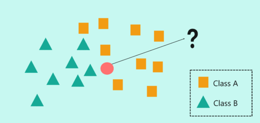

<!--
[![Contributors][contributors-shield]][contributors-url]
[![Forks][forks-shield]][forks-url]
[![Stargazers][stars-shield]][stars-url]
[![Issues][issues-shield]][issues-url]
[![MIT License][license-shield]][license-url]
[![LinkedIn][linkedin-shield]][linkedin-url]
 -->


<!-- PROJECT LOGO -->
<br />
<h3 align="center">K-Nearest Neighbours from scratch</h3>
<p align="center">Comparaison with Sklearn implementataion</p>
<p align="center">
  <a href="https://executive-education.dauphine.psl.eu/formations/executive-master-diplome-universite/ia-science-donnees" target="_blank">
    
  </a>


<!-- TABLE OF CONTENTS -->
<details open="open">
  <summary><h2> Table of Contents</h2></summary>
  <ol>
    <li>
      <a href="#about-the-project">About The Project</a>
      <ul>
        <li><a href="#description">Description</a></li>
      </ul>
      <ul>
        <li><a href="#datasets">Datasets</a></li>
      </ul>
    </li>
    <li>
      <a href="#getting-started">Getting Started</a>
      <ul>
        <li><a href="#prerequisites">Prerequisites</a></li>
        <li><a href="#installation">Installation</a></li>
      </ul>
    </li>
    <li><a href="#usage">Usage</a></li>

  </ol>
</details>


<!-- ABOUT THE PROJECT -->
## About The Project
  
K-Nearest Neighbours is **a classification technique where a new sample is classified by looking at the nearest classified points**, hence "K-nearest".
In the example above, if k=7, then an unclassified point would be classified as a triangle.
**If** the value of **k is too low, then it can be subject to outliers**. However, **if it’s too high, then it may overlook classes with only a few samples**.

**This project is a example of implementation of K-Nearest Neighbours that I implemented from scratch, based on the euclidean distance.
My main objective was to understand what under the hood and gain a better intuition.
The results are compared with sklearn for consistency.**


### Description
<p style='color:red'>Much of the code has been stored in my own package and modules to make the Jupyter Notebook more readable.</p>
The project contains:

```sh
- 1 Jupyter Notebooks as the main files:
	* KNN.ipynb
	
- 1 package: mypackage
	* module : classifier.py	
```


<a href="https://github.com/DanielOmola/Data_Science_Portfolio/tree/main/K_Nearest_Neighbors" target="_blank">Project Link</a>
	

### Datasets
Iris datasets.

<!-- GETTING STARTED -->
## Getting Started


### Prerequisites
*  Python3
*  Jupyter Notebook
*  Pandas
*  Numpy
*  Sklearn (for comparaison)

### Installation

If you chose the first installation method, make sure the prerequisites are available in your system.

#### Method - 1
1. Clone the repo
```JS
   git clone https://github.com/DanielOmola/Data_Science_Portfolio/tree/main/K_Nearest_Neighbors
```
2. Open one of the file below in Jupyter Notebook
```JS
   Linear_Regression.ipynb
```
<!-- -->

#### Method - 2
(the easiest way if docker is already installed in your system)
1. Clone the repo
```JS
   git clone https://github.com/DanielOmola/Data_Science_Portfolio/tree/main/K_Nearest_Neighbors
```
2. Open the terminal and move to the cloned directory 
```JS
   cd PATH/TO/THE/DIRECTORY
```
3. Create a Docker image from the terminal
```JS
   docker build . --no-cache=true -f Dockerfile.txt -t knn
```
4. Run the Docker image
```JS
 docker run -it -p 8888:8888 knn
```


<!-- USAGE EXAMPLES -->
## Usage

Play with it as you want. Chanke hyperparameter to see how the model performs on test set.


<!-- CONTACT -->
## Contact

Daniel OMOLA - daniel.omola@gmail.com


<!-- Recommended links -->
## Recommended links

* <a href="https://www.youtube.com/watch?v=nk2CQITm_eo" target="_blank">StatQuest: Linear Models Pt.1 - Linear Regression</a>
* <a href="https://www.youtube.com/watch?v=Q81RR3yKn30" target="_blank">Regularization Part 1: Ridge (L2) Regression</a>
* <a href="https://www.youtube.com/watch?v=NGf0voTMlcs" target="_blank">Regularization Part 2: Lasso (L1) Regression</a>
* <a href="https://www.youtube.com/watch?v=1dKRdX9bfIo" target="_blank">Regularization Part 3: Elastic Net Regression</a>
* <a href="https://www.youtube.com/watch?v=sDv4f4s2SB8&t=1138s" target="_blank">Gradient Descent, Step-by-Step</a>
