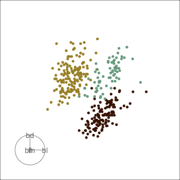
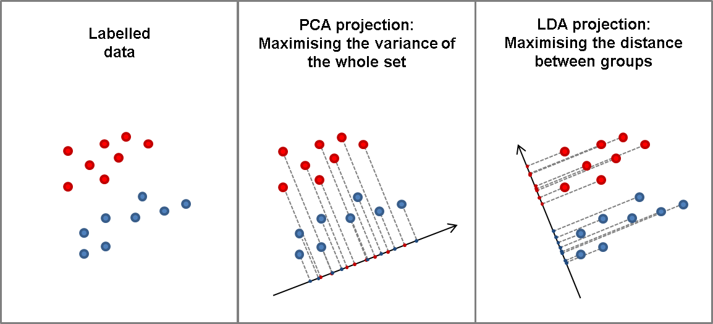
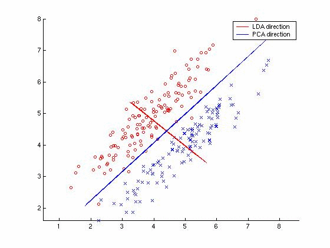

<!--
[![Contributors][contributors-shield]][contributors-url]
[![Forks][forks-shield]][forks-url]
[![Stargazers][stars-shield]][stars-url]
[![Issues][issues-shield]][issues-url]
[![MIT License][license-shield]][license-url]
[![LinkedIn][linkedin-shield]][linkedin-url]
 -->


<!-- PROJECT LOGO -->
<br />
<h3 align="center">Linear Discriminant Analysis from scratch</h3>

<p align="center">
  <a href="https://executive-education.dauphine.psl.eu/formations/executive-master-diplome-universite/ia-science-donnees" target="_blank">
    
  </a>


<!-- TABLE OF CONTENTS -->
<details open="open">
  <summary><h2> Table of Contents</h2></summary>
  <ol>
    <li>
      <a href="#about-the-project">About The Project</a>
      <ul>
        <li><a href="#description">Description</a></li>
      </ul>
      <ul>
        <li><a href="#datasets">Datasets</a></li>
      </ul>
    </li>
    <li>
      <a href="#getting-started">Getting Started</a>
      <ul>
        <li><a href="#prerequisites">Prerequisites</a></li>
        <li><a href="#installation">Installation</a></li>
      </ul>
    </li>
    <li><a href="#usage">Usage</a></li>

  </ol>
</details>


<!-- ABOUT THE PROJECT -->
## About The Project
  
LDA is a supervised dimensionality reduction method that tries to preserve the discriminatory information between different classes of the data set.
Although different, LDA is often compared to PCA. 
PCA can be described as an "unsupervised" algorithm, since it "ignores" class labels and its goal is to find the directions (the so-called principal components) that maximize the variance in a dataset.
In contrast to PCA, LDA is "supervised" and computes the directions ("linear discriminants") that will represent the axes that that maximize the separation between multiple classes.







This project is a example of implementation of K-Means from scratch. The algorithm is applyed to different shape clusters in order to understand
when it suitable and when is not.


### Description
**Much of the code has been stored in my own package and modules to make the Jupyter Notebook more readable.**
The project contains:

```sh
- 1 Jupyter Notebooks as the main files:
	* K_Means.ipynb
	
- 1 package: mypackage
	* module : clustering.py	
	* module : ploter.py
```

<a href="https://github.com/DanielOmola/Data_Science_Portfolio/tree/main/LDA_From_Scratch" target="_blank">Project Link</a>
	

### Datasets
Simulated Data and Sci-kit learn data sets.

<!-- GETTING STARTED -->
## Getting Started


### Prerequisites
*  Python3
*  Jupyter Notebook
*  Pandas
*  Numpy
*  Plotly
*  sklearn

### Installation

If you chose the first installation method, make sure the prerequisites are available in your system.

#### Method - 1
1. Clone the repo
```JS
   git clone https://github.com/DanielOmola/Data_Science_Portfolio/tree/main/LDA_From_Scratch
```
2. Open one of the file below in Jupyter Notebook
```JS
   K_Means.ipynb
```
<!-- -->

#### Method - 2
(the easiest way if docker is already installed in your system)
1. Clone the repo
```JS
   git clone https://github.com/DanielOmola/Data_Science_Portfolio/tree/main/LDA_From_Scratch
```
2. Open the terminal and move to the cloned directory 
```JS
   cd PATH/TO/THE/DIRECTORY
```
3. Create a Docker image from the terminal
```JS
   docker build . --no-cache=true -f Dockerfile.txt -t lda
```
4. Run the Docker image
```JS
 docker run -it -p 8888:8888 lda
```


<!-- USAGE EXAMPLES -->
## Usage

Play with it as you want.


<!-- CONTACT -->
## Contact

Daniel OMOLA - daniel.omola@gmail.com


<!-- Recommended links -->
## Recommended links

* <a href="https://www.youtube.com/watch?v=azXCzI57Yfc&t=201s" target="_blank">StatQuest: Linear Discriminant Analysis (LDA) clearly explained</a>
