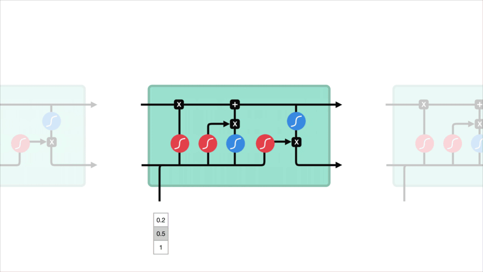
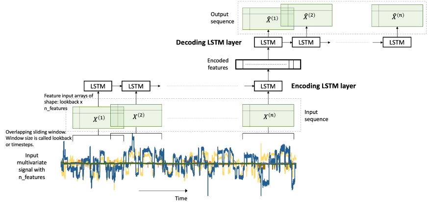

<!--
[![Contributors][contributors-shield]][contributors-url]
[![Forks][forks-shield]][forks-url]
[![Stargazers][stars-shield]][stars-url]
[![Issues][issues-shield]][issues-url]
[![MIT License][license-shield]][license-url]
[![LinkedIn][linkedin-shield]][linkedin-url]
 -->


<!-- PROJECT LOGO -->
<br />
<h3 align="center">LSTM Autoencoder for Anomaly Detection</h3>
<p align="center">on SP500 and VIX time series</p>
<p align="center">
  <a href="https://executive-education.dauphine.psl.eu/formations/executive-master-diplome-universite/ia-science-donnees" target="_blank">
    
  </a>


<!-- TABLE OF CONTENTS -->
<details open="open">
  <summary><h2> Table of Contents</h2></summary>
  <ol>
    <li>
      <a href="#about-the-project">About The Project</a>
      <ul>
        <li><a href="#description">Description</a></li>
      </ul>
      <ul>
        <li><a href="#datasets">Datasets</a></li>
      </ul>
    </li>
    <li>
      <a href="#getting-started">Getting Started</a>
      <ul>
        <li><a href="#prerequisites">Prerequisites</a></li>
        <li><a href="#installation">Installation</a></li>
      </ul>
    </li>
    <li><a href="#usage">Usage</a></li>

  </ol>
</details>


<!-- ABOUT THE PROJECT -->
## About The Project
  
A LSTM Autoencoder is an implementation of autoencoder for time series using an Encoder-Decoder LSTM architecture.

Once fitted, the encoder part of the model can be used to:

* encode or compress sequence data that in turn may be used in data visualizations or as a feature vector input to a supervised learning model,

* predict anomalies on time series.
  <a href="https://executive-education.dauphine.psl.eu/formations/executive-master-diplome-universite/ia-science-donnees" target="_blank">
    
  </a>

This project is a example of implementenation of LSTM Autoencoder for time series anomalies detection.
 

### Description
<p style='color:red'>Much of the code has been stored into my own package and modules to make the Jupyter Notebook more readable.</p>
The project contains:

```sh
- 2 Jupyter Notebooks as the main files:
	* Anomaly_Detection_SP500.ipynb
	* Anomaly_Detection_VIX.ipynb
	
- 1 package: mypackage
	* module : create_dataset.py	
	* module : LSTM_autoencoder.py
	* module : mydataloader.py
	* module : ploter.py
	* module : stationarity.py
```


<a href="https://github.com/DanielOmola/Data_Science_Portfolio/tree/main/LSTM_Anomaly_Detection" target="_blank">Project Link</a>
	

### Datasets

* <a href="https://finance.yahoo.com/quote/%5EGSPC/history?p=%5EGSPC" target="_blank">S&P 500 (^GSPC) historical data</a>
* <a href="https://finance.yahoo.com/quote/%5EVIX/history?p=%5EVIX)" target="_blank">CBOE Volatility Index (^VIX) historical data</a>

<!-- GETTING STARTED -->
## Getting Started


### Prerequisites
*  Python3
*  Jupyter Notebook
*  Tensorflow
*  Keras
*  Pandas
*  Numpy
*  Statsmodels
*  Plotly

### Installation

If you chose the first installation method, make sure the prerequisites are available in your system.

#### Method - 1
1. Clone the repo
```JS
   git clone https://github.com/DanielOmola/Data_Science_Portfolio/tree/main/LSTM_Anomaly_Detection
```
2. Open one of the file below in Jupyter Notebook
```JS
   Anomaly_Detection_SP500.ipynb
   Anomaly_Detection_VIX.ipynb
```
<!-- -->

#### Method - 2
(the easiest way if docker is already installed in your system)
1. Clone the repo
```JS
   git clone https://github.com/DanielOmola/Data_Science_Portfolio/tree/main/LSTM_Anomaly_Detection
```
2. Open the terminal and move to the cloned directory 
```JS
   cd PATH/TO/THE/DIRECTORY
```
3. Create a Docker image from the terminal
```JS
   docker build . --no-cache=true -f Dockerfile.txt -t anomaly_detection
```
4. Run the Docker image
```JS
 docker run -it -p 8888:8888 anomaly_detection
```


<!-- USAGE EXAMPLES -->
## Usage

Play with it as you want.


<!-- CONTACT -->
## Contact

Daniel OMOLA - daniel.omola@gmail.com


<!-- Recommended links -->
## Recommended links

* <a href="https://en.wikipedia.org/wiki/Long_short-term_memory" target="_blank">LSTM</a>
* <a href="https://en.wikipedia.org/wiki/Autoencoder" target="_blank">Autoencoder</a>
* <a href="https://www.tensorflow.org/api_docs/python/tf/keras/layers/LSTM" target="_blank">Long Short-Term Memory layer on TensorFlow</a>
* <a href="https://static.googleusercontent.com/media/research.google.com/fr//pubs/archive/46283.pdf" target="_blank">Time Series Anomaly Detection</a>
