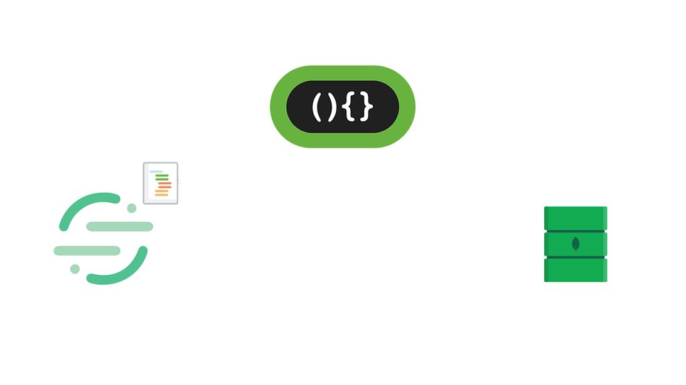

<!--
[![Contributors][contributors-shield]][contributors-url]
[![Forks][forks-shield]][forks-url]
[![Stargazers][stars-shield]][stars-url]
[![Issues][issues-shield]][issues-url]
[![MIT License][license-shield]][license-url]
[![LinkedIn][linkedin-shield]][linkedin-url]
 -->


<!-- PROJECT LOGO -->
<br />
<h3 align="center">MongoDB queries</h3>
<p align="center">
  <a href="https://executive-education.dauphine.psl.eu/formations/executive-master-diplome-universite/ia-science-donnees" target="_blank">
    
  </a>


<!-- TABLE OF CONTENTS -->
<details open="open">
  <summary><h2> List of queries</h2></summary>
  <p style="color:red;"> Query 1 must be executed first otherwise the queries containing dates cannot be executed.<br>
  Also note that the order of execution doesn't matter for the query from 2 to 6 as long as the Query one has been executed first. 
  </p>
  <ul>
    <li><a href="#query-1">Query 1</a></li>
    <li><a href="#query-2">Query 2</a></li>
    <li><a href="#query-3">Query 3</a></li>
    <li><a href="#query-4">Query 4</a></li>
    <li><a href="#query-5">Query 5</a></li>
    <li><a href="#query-6">Query 6</a></li>
  </ul>
</details>


<!-- NEW QUERY -->

## Query 1

Create a new isodate field containing the date in unix format

```js
db.articles.aggregate( [ 
  { $addFields: { 
...       isodate: { 
...          $dateFromString: { dateString: { 
...          $substr : ["$date", 0, 11] 
...       } 
...          } 
...       } 
...    } 
... } ,
{ "$out": "articles" } ] )
```

<!-- NEW QUERY -->

##  Query 2
Find all articles related to world stock exchanges that contain one
	  or more of the following keywords: fall, crash, crack, decline, panic, fear.
```js
db.articles.find({
exchanges : { $exists: true , $ne: ""} ,
"text.body": { $regex: /fall|crash|crack|decline|panic|fear/} 
}).pretty()
```

<!-- NEW QUERY -->

##  Query 3
Count the number of documents per country sorted in descending order

```js
d = new Date;
db.articles.aggregate([ 
{ $group: {_id: "$places",  count: { $sum: 1 } } },
{$sort:{"count":-1}}
] );
print(new Date - d + 'ms')
```

<!-- NEW QUERY -->

##  Query 4
Count the number of documents per country sorted in descending order

```js

d = new Date;
db.articles.aggregate([ 
{ $group: {_id: "$places",  count: { $sum: 1 } } },
{$sort:{"count":-1}}
] );
print(new Date - d + 'ms')
```


<!-- NEW QUERY -->

##  Query 5
Read the last 10 articles published on the Tokyo Stock Exchange
	  (or other exchange)

```js
db.articles.find({ exchanges:'tse'}).sort({'isodate' : -1}).limit(10 ).pretty()
```

<!-- NEW QUERY -->

##  Query 6
Find all the articles related to world stock exchanges published
	  on a given date (here on Black Thursday)

```js
db. articles.find({
"isodate":{
			"$gte": ISODate("1987-10-19T00:00:00Z"),
			"$lt": ISODate("1987-10-20T00:00:00Z")},
exchanges : { $exists: true , $ne: ""} }).pretty();
```


<!-- CONTACT -->
## Contact

Daniel OMOLA - daniel.omola@gmail.com


<!-- Recommended links -->
## Recommended links

* <a href="https://docs.mongodb.com/manual/tutorial/query-documents/" target="_blank">MongoDB: Query Documents</a>
* <a href="https://docs.mongodb.com/manual/crud/" target="_blank">MongoDB: CRUD Operations</a>
