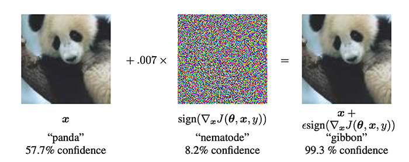

<!--
[![Contributors][contributors-shield]][contributors-url]
[![Forks][forks-shield]][forks-url]
[![Stargazers][stars-shield]][stars-url]
[![Issues][issues-shield]][issues-url]
[![MIT License][license-shield]][license-url]
[![LinkedIn][linkedin-shield]][linkedin-url]
 -->


<!-- PROJECT LOGO -->
<br />
<h3 align="center">Neural Networks Adversarial Attacks and Defense</h3>
<p align="center">How to build robust NN</p>
<p align="center">
  <a href="https://executive-education.dauphine.psl.eu/formations/executive-master-diplome-universite/ia-science-donnees" target="_blank">
    
  </a>


<!-- TABLE OF CONTENTS -->
<details open="open">
  <summary><h2> Table of Contents</h2></summary>
  <ol>
    <li>
      <a href="#about-the-project">About The Project</a>
      <ul>
        <li><a href="#description">Description</a></li>
      </ul>
      <ul>
        <li><a href="#datasets">Datasets</a></li>
      </ul>
    </li>
    <li>
      <a href="#getting-started">Getting Started</a>
      <ul>
        <li><a href="#prerequisites">Prerequisites</a></li>
        <li><a href="#installation">Installation</a></li>
      </ul>
    </li>
    <li><a href="#usage">Usage</a></li>

  </ol>
</details>


<!-- ABOUT THE PROJECT -->
## About The Project
  
Adversarial machine learning is a machine learning technique that attempts to fool models by supplying deceptive input.
The most common reason is to cause a malfunction in a machine learning model.
Most machine learning techniques were designed to work on specific problem sets in which the training
and test data are generated from the same statistical distribution (IID).
When those models are applied to the real world, adversaries may supply data that violates that statistical assumption.
This data may be arranged to exploit specific vulnerabilities and compromise the results.

4 types of attacks can be identified :

* Poisoning (Causative) Attack: Attack on training phase.
Naive Bayes classifiers mostly used in text classification. It is widely used in :

* Evasion (Exploratory) Attack: Attack on testing phase.

* Model Inversion Attack: Extract private and sensitive inputs by leveraging
the outputs and ML model.

* Model Inversion Attack: Extract private and sensitive inputs by leveraging
the outputs and ML model.

* Model Extraction Attack: Extract model parameters via querying the model.

Evasion Attacks are the more common. They can be further classified into

* White-Box: Attackers know full knowledge about the ML algorithm,
ML model, (i.e., parameters and hyperparameters), architecture, etc.

* Black-Box: Attackers almost know nothing about the ML system
(perhaps know number of features, ML algorithm).

This project explores how to build adversarial attacks (from scratch), how to use them aggainst Neural Networks and
and how to train NN against attacks in the context of image classification. 

Two White Box attacks are implemented - Fast Gradient Sign (FGSM) and Projected Gradient (PGD).
They are used for both attacking (first step) and training (second step) a Fully Connected Linear NN and a Conv2D NN.
All the performance are displayed to assess how each model perform against each attacks (before being train against the 
attacks and after being trained against the attacks).

### Description
<p style='color:red'>Much of the code has been stored in my own package and modules to make the Jupyter Notebook more readable.</p>

This project contains:

```sh
- 1 python file as the main file: app.py

- 1 package: mypackage
	* module : Attacks.py	
	* module : DataLoader.py
	* module : NN.py
	* module : ploter.py
	* module : ploter.py
```

<a href="https://github.com/DanielOmola/Data_Science_Portfolio/tree/main/Neural_Networks_Adversarial_Attacks_Defense" target="_blank">Project Link</a>


 

### Datasets

* <a href="http://yann.lecun.com/exdb/mnist/" target="_blank">MNIST</a>

<!-- GETTING STARTED -->
## Getting Started


### Prerequisites
*  Python3
*  Pandas
*  Numpy
*  scipy
*  seaborn
*  torch
*  torchvision


### Installation

If you chose the first installation method, make sure the prerequisites are available in your system.

#### Method - 1
1. Clone the repo
```JS
   git clone https://github.com/DanielOmola/Data_Science_Portfolio/tree/main/Neural_Networks_Adversarial_Attacks_Defense
```
2. Open Terminal, go the clonedd directory and run
```JS
   python app.py
```

#### Method - 2
(the easiest way if docker is already installed in your system)

1. Clone the repo
```JS
   git clone https://github.com/DanielOmola/Data_Science_Portfolio/tree/main/Neural_Networks_Adversarial_Attacks_Defense
```
2. Create a Docker image
```JS
   docker build . --no-cache=true -f Dockerfile.txt -t adversarial
```
3. Run the Docker image
```JS
 docker run -it adversarial
```


<!-- USAGE EXAMPLES -->
## Usage

Play with it as you want.


<!-- CONTACT -->
## Contact

Daniel OMOLA - daniel.omola@gmail.com

[Project Link](https://github.com/DanielOmola/Data_Science_Portfolio/tree/main/Neural_Networks_Adversarial_Attacks_Defense)


<!-- Recommended links -->
## Recommended links

* <a href="https://medium.com/swlh/gradient-based-adversarial-attacks-an-introduction-526238660dc9" target="_blank">Gradient-based Adversarial Attacks : An Introduction</a>
* <a href="https://user.eng.umd.edu/~danadach/Security_Fall_17/aml.pdf" target="_blank">Adversarial Machine Learning</a>
* <a href="https://engineering.purdue.edu/ChanGroup/ECE595/files/chapter3.pdf" target="_blank">FGSM Attack</a>
* <a href="https://www.research.ibm.com/labs/ireland/nemesis2018/pdf/tutorial.pdf" target="_blank">FGSM, PGD and other attacks</a>


