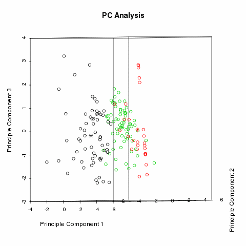
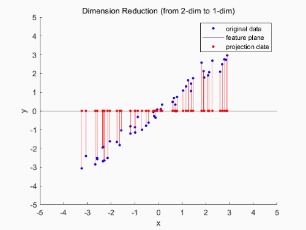

<!--
[![Contributors][contributors-shield]][contributors-url]
[![Forks][forks-shield]][forks-url]
[![Stargazers][stars-shield]][stars-url]
[![Issues][issues-shield]][issues-url]
[![MIT License][license-shield]][license-url]
[![LinkedIn][linkedin-shield]][linkedin-url]
 -->


<!-- PROJECT LOGO -->
<br />
<h3 align="center">PCA from scratch</h3>
<p align="center">Iris datasets visualization</p>
<p align="center">
  <a href="https://executive-education.dauphine.psl.eu/formations/executive-master-diplome-universite/ia-science-donnees" target="_blank">
    
  </a>


<!-- TABLE OF CONTENTS -->
<details open="open">
  <summary><h2> Table of Contents</h2></summary>
  <ol>
    <li>
      <a href="#about-the-project">About The Project</a>
      <ul>
        <li><a href="#description">Description</a></li>
      </ul>
      <ul>
        <li><a href="#datasets">Datasets</a></li>
      </ul>
    </li>
    <li>
      <a href="#getting-started">Getting Started</a>
      <ul>
        <li><a href="#prerequisites">Prerequisites</a></li>
        <li><a href="#installation">Installation</a></li>
      </ul>
    </li>
    <li><a href="#usage">Usage</a></li>

  </ol>
</details>


<!-- ABOUT THE PROJECT -->
### About The Project
  
Principal Component Analysis, or PCA, is **a dimensionality-reduction method that is often used to reduce the dimensionality of large data sets or visiualization**, 
by transforming a large set of variables into a smaller one that still contains most of the information in the large set.

<a href="https://executive-education.dauphine.psl.eu/formations/executive-master-diplome-universite/ia-science-donnees" target="_blank">

</a>

**Principal components** are **new variables that are** constructed as **linear combinations** or mixtures **of the initial variables**.
These combinations are done **in such a way that the new variables** (i.e., **principal components**) **are uncorrelated** and most 
of the information within the initial variables is squeezed or compressed into the first components. So, the idea is **10-dimensional data
gives you 10 principal components**, but **PCA tries to put maximum possible information in the first component, then maximum remaining information
in the second and so on.**
**The principal components are less interpretable and don’t have any real meaning** since they are constructed as linear combinations of the initial variables.

**This project is a example of PCA algorithm that I implemented from scratch. My main objective was to understand what under the hood and gain a better intuition.**

### Description
<p style='color:red'>Much of the code has been stored in my own package and modules to make the Jupyter Notebook more readable.</p>
The project contains:

```sh
- 1 Jupyter Notebooks as the main files:
	* PCA.ipynb
```
<a href="https://github.com/DanielOmola/Data_Science_Portfolio/tree/main/PCA_From_Scratch" target="_blank">Project Link</a>
	

### Datasets
Iris data set

<!-- GETTING STARTED -->
## Getting Started


### Prerequisites
*  Python3
*  Jupyter Notebook
*  Pandas
*  Numpy

### Installation

If you chose the first installation method, make sure the prerequisites are available in your system.

#### Method - 1
1. Clone the repo
```JS
   git clone https://github.com/DanielOmola/Data_Science_Portfolio/tree/main/PCA_From_Scratch
```
2. Open one of the file below in Jupyter Notebook
```JS
   Linear_Regression.ipynb
```
<!-- -->

#### Method - 2
(the easiest way if docker is already installed in your system)
1. Clone the repo
```JS
   git clone https://github.com/DanielOmola/Data_Science_Portfolio/tree/main/PCA_From_Scratch
```
2. Open the terminal and move to the cloned directory 
```JS
   cd PATH/TO/THE/DIRECTORY
```
3. Create a Docker image from the terminal
```JS
   docker build . --no-cache=true -f Dockerfile.txt -t pca
```
4. Run the Docker image
```JS
 docker run -it -p 8888:8888 pca
```


<!-- USAGE EXAMPLES -->
## Usage

Play with it as you want. Chanke hyperparameter to see how the model performs on test set.


<!-- CONTACT -->
## Contact

Daniel OMOLA - daniel.omola@gmail.com


<!-- Recommended links -->
## Recommended links

* <a href="https://www.youtube.com/watch?v=FgakZw6K1QQ" target="_blank">Principal Component Analysi step by step</a>
* <a href="https://www.youtube.com/watch?v=g-Hb26agBFg" target="_blank">Principal Component Analysis</a>
