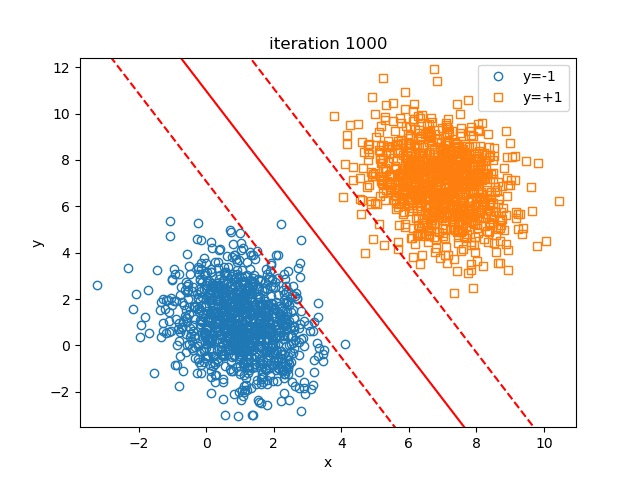
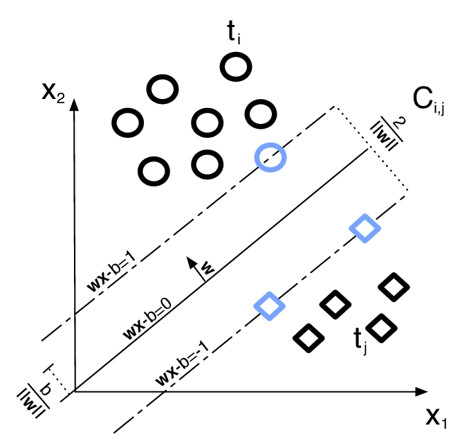
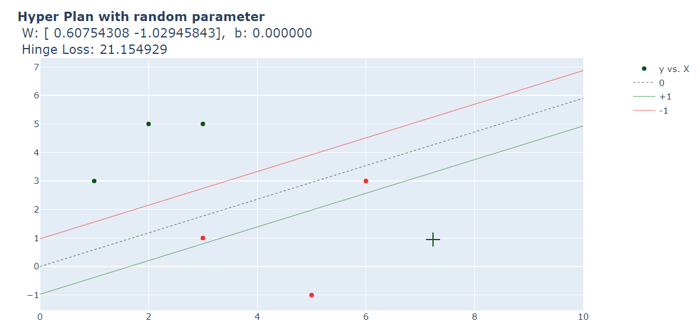

<!--
[![Contributors][contributors-shield]][contributors-url]
[![Forks][forks-shield]][forks-url]
[![Stargazers][stars-shield]][stars-url]
[![Issues][issues-shield]][issues-url]
[![MIT License][license-shield]][license-url]
[![LinkedIn][linkedin-shield]][linkedin-url]
 -->


<!-- PROJECT LOGO -->
<br />
<h3 align="center">Suport Vector Machine</h3>
<p align="center">from scratch</p>
<p align="center">
  <a href="https://executive-education.dauphine.psl.eu/formations/executive-master-diplome-universite/ia-science-donnees" target="_blank">
    
  </a>


<!-- TABLE OF CONTENTS -->
<details open="open">
  <summary><h2> Table of Contents</h2></summary>
  <ol>
    <li>
      <a href="#about-the-project">About The Project</a>
      <ul>
        <li><a href="#description">Description</a></li>
      </ul>
      <ul>
        <li><a href="#datasets">Datasets</a></li>
      </ul>
    </li>
    <li>
      <a href="#getting-started">Getting Started</a>
      <ul>
        <li><a href="#prerequisites">Prerequisites</a></li>
        <li><a href="#installation">Installation</a></li>
      </ul>
    </li>
    <li><a href="#usage">Usage</a></li>

  </ol>
</details>


<!-- ABOUT THE PROJECT -->
## About The Project
  
Support Vector Machine (SVM) is a supervised machine learning algorithm which can be used for both classification or regression challenges.

This project is a example of implementation of SVM Classifier that I implemented from scratch. My main objective was to understand what under the hood and gain a better intuition.**.


The optimization process is based on sub gradient descent approach,
better suited for hinge loss, a non differentiable loss function
 

### Description
<p style='color:red'>Much of the code has been stored in my own package and modules to make the Jupyter Notebook more readable.</p>

The project contains:

```sh
- 1 Jupyter Notebooks as the main file:
	* SVM.ipynb
	
- 1 package: mypackage
	* module : SVM.py	
	* module : hingeloss.py
	* module : mydataloader.py
	* module : ploter.py
```

<a href="https://github.com/DanielOmola/Data_Science_Portfolio/tree/main/SVM_Classifier_From_Scratch" target="_blank">Project Link</a>
	

### Datasets

* Linearly separable data generated from numpy.
* Non linearly separable data generated from numpy.

<!-- GETTING STARTED -->
## Getting Started


### Prerequisites

*  Jupyter Notebook
*  numpy
*  sklearn

### Installation

If you chose the first installation method, make sure the prerequisites are available in your system.

#### Method - 1
1. Clone the repo
```JS
   git clone https://github.com/DanielOmola/Data_Science_Portfolio/tree/main/SVM_Classifier_From_Scratch
```
2. Open the file below in Jupyter Notebook
```JS
   SVM.ipynb
```
<!-- -->

#### Method - 2
(the easiest way if docker is already installed in your system)
1. Clone the repo
```JS
   git clone https://github.com/DanielOmola/Data_Science_Portfolio/tree/main/SVM_Classifier_From_Scratch
```
2. Open the terminal and move to the cloned directory 
```JS
   cd PATH/TO/THE/DIRECTORY
```
3. Create a Docker image from the terminal
```JS
   docker build . --no-cache=true -f Dockerfile.txt -t svm
```
4. Run the Docker image
```JS
 docker run -it -p 8888:8888 svm
```


<!-- USAGE EXAMPLES -->
## Usage

Play with it as you want.



<!-- CONTACT -->
## Contact

Daniel OMOLA - daniel.omola@gmail.com


<!-- Recommended links -->
## Recommended links

* <a href="https://www.youtube.com/watch?v=_PwhiWxHK8o" target="_blank">Learning: Support Vector Machines (Best video ever to my point of view !)</a>
* <a href="https://www.youtube.com/watch?v=efR1C6CvhmE" target="_blank">Support Vector Machines Part 1 (of 3): Main Ideas!!!</a>
* <a href="https://www.youtube.com/watch?v=Lpr__X8zuE8" target="_blank">Support Vector Machines (SVMs): A friendly introduction</a>
* <a href="https://www.youtube.com/watch?v=Toet3EiSFcM" target="_blank">Support Vector Machines Part 2: The Polynomial Kernel (Part 2 of 3)</a>

