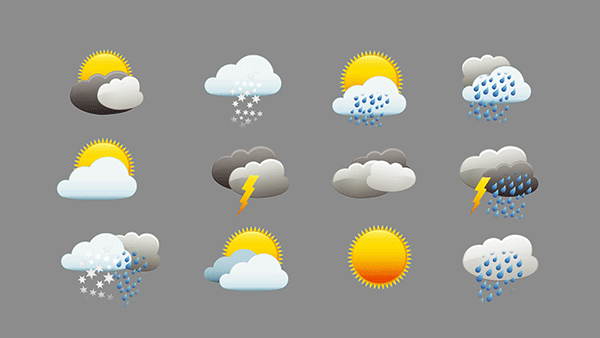

<!--
[![Contributors][contributors-shield]][contributors-url]
[![Forks][forks-shield]][forks-url]
[![Stargazers][stars-shield]][stars-url]
[![Issues][issues-shield]][issues-url]
[![MIT License][license-shield]][license-url]
[![LinkedIn][linkedin-shield]][linkedin-url]
 -->


<!-- PROJECT LOGO -->
<br />
<h3 align="center">Regression Tree with Spark ML and Scala</h3>
<p align="center">(for predicting <b>hours played based on weather condition</b> and <b>used car value</b>)</p>
<p align="center">
  <table>
  <tr>
  	<td><a href="https://executive-education.dauphine.psl.eu/formations/executive-master-diplome-universite/ia-science-donnees" target="_blank">
	</a></td>
    <td><a href="https://executive-education.dauphine.psl.eu/formations/executive-master-diplome-universite/ia-science-donnees" target="_blank">
	</a></td>
	</tr>
  </table>	
  </a>


<!-- TABLE OF CONTENTS -->
<details open="open">
  <summary><h2> Table of Contents</h2></summary>
  <ol>
    <li>
      <a href="#about-the-project">About The Project</a>
      <ul>
        <li><a href="#description">Description</a></li>
      </ul>
      <ul>
        <li><a href="#datasets">Datasets</a></li>
      </ul>
    </li>
    <li>
      <a href="#getting-started">Getting Started</a>
      <ul>
        <li><a href="#prerequisites">Prerequisites</a></li>
        <li><a href="#installation">Installation</a></li>
      </ul>
    </li>
    <li><a href="#usage">Usage</a></li>

  </ol>
</details>


<!-- ABOUT THE PROJECT -->
## About the Projects

### Project 1  
The first project aims at predicting time played based on several weather characteristics (outlook, temperature...).
Note that the dataset used here is a synthetic one and should be used only for getting one's hand on Spark ML. 


### Project 2
The second project aims at predicting used car value based on characteristics including brand, vehicle type, year of registration...
Note that unlike the first project, the dataset corresponds to the real-world data with more than one million rows.

### Description

The first project contains:

```sh
- 1 Jupyter Notebooks as the main file:

	* Regression_Tree_Spark_ML_Small_Dataset.ipynb
	
```

The second project contains:

```sh
- 1 Jupyter Notebooks as the main file:

	* Regression_Tree_Spark_ML_Large_Dataset.ipynb

```


<a href="https://github.com/DanielOmola/Data_Science_Portfolio/tree/main/Spark_ML_Regression_Tree" target="_blank">Project Link</a>
	

### Datasets
* regtree.csv, a small synthetic dataset for the first project.

* auto.csv, a large dataset from kaggle

<!-- GETTING STARTED -->
## Getting Started


### Prerequisites
*  Jupyter Notebook with Spylon Kernel


### Installation

If you chose the first installation method, make sure the prerequisites are available in your system.

#### Method - 1
1. Clone the repo
```JS
   git clone https://github.com/DanielOmola/Data_Science_Portfolio/tree/main/Spark_ML_Regression_Tree
```
2. Run the notebooks with Jupyter based on the spylon kernel.

```JS
	* Regression_Tree_Spark_ML_Small_Dataset.ipynb
	* Regression_Tree_Spark_ML_Large_Dataset.ipynb
```
<!-- -->

#### Method - 2
(the easiest way if docker is already installed in your system)

1. Clone the repo
```JS
   git clone https://github.com/DanielOmola/Data_Science_Portfolio/tree/main/Spark_ML_Regression_Tree
```
2. Open the terminal and move to the cloned directory 
```JS
   cd PATH/TO/THE/DIRECTORY
```
3. Create a Docker image from the terminal with the comand below
```JS
   docker build . --no-cache=true -f Dockerfile.txt -t regtree
```
4. Run the Docker image
```JS
 docker run -it -p 8888:8888 regtree
```


<!-- USAGE EXAMPLES -->
## Usage

Play with it as you want.


<!-- CONTACT -->
## Contact

Daniel OMOLA - daniel.omola@gmail.com


<!-- Recommended links -->
## Recommended links

* <a href="https://spark.apache.org/docs/latest/ml-guide.html" target="_blank">Spark Machine Learning Library (MLlib) Guide</a>
* <a href="https://spark.apache.org/docs/latest/ml-features" target="_blank">Extracting, transforming and selecting features</a>
* <a href="https://spark.apache.org/docs/latest/ml-classification-regression.html#regression" target="_blank">Regression with Spark ML</a>
