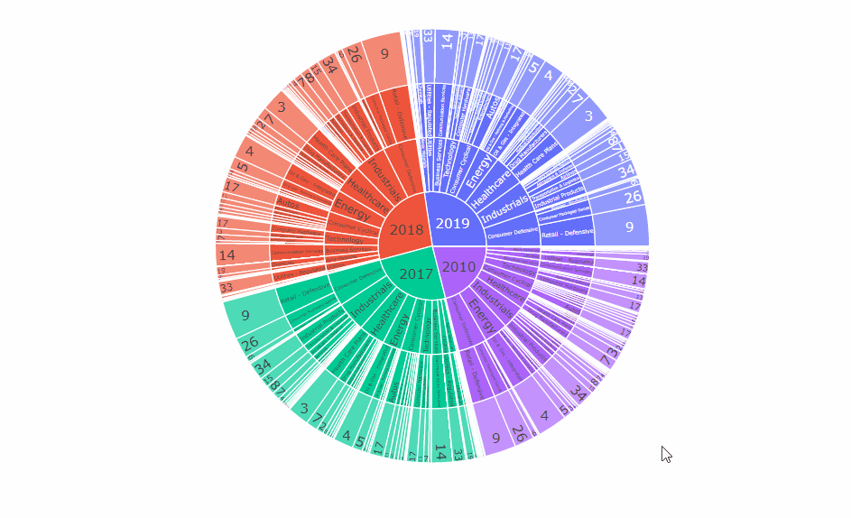
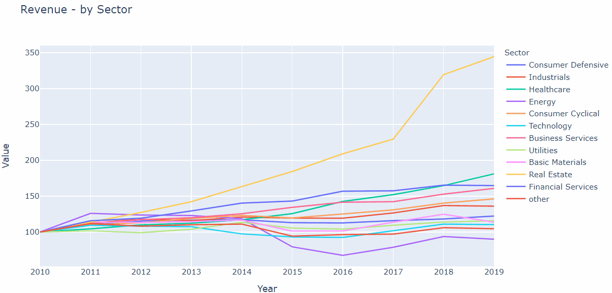

<!--
[![Contributors][contributors-shield]][contributors-url]
[![Forks][forks-shield]][forks-url]
[![Stargazers][stars-shield]][stars-url]
[![Issues][issues-shield]][issues-url]
[![MIT License][license-shield]][license-url]
[![LinkedIn][linkedin-shield]][linkedin-url]
 -->


<!-- PROJECT LOGO -->
<br />
<h3 align="center">Corporate Finance Data cleaning exploration and vizualization</h3>
<p align="center">Leverage the benefit of Plotly interactive graphs to clean and get insights from financial data</p>
<p align="center">
  <a href="https://executive-education.dauphine.psl.eu/formations/executive-master-diplome-universite/ia-science-donnees" target="_blank">
    
  </a>


<!-- TABLE OF CONTENTS -->
<details open="open">
  <summary><h2> Table of Contents</h2></summary>
  <ol>
    <li>
      <a href="#about-the-project">About The Project</a>
      <ul>
        <li><a href="#description">Description</a></li>
      </ul>
      <ul>
        <li><a href="#datasets">Datasets</a></li>
      </ul>
    </li>
    <li>
      <a href="#getting-started">Getting Started</a>
      <ul>
        <li><a href="#prerequisites">Prerequisites</a></li>
        <li><a href="#installation">Installation</a></li>
      </ul>
    </li>
    <li><a href="#usage">Usage</a></li>

  </ol>
</details>


<!-- ABOUT THE PROJECT -->
## About The Project


  


This project aims at :
* exploring the benefit of Plotly interactive graphs in data cleaning,
* exploring advanced visualization tools available in plotly,
* assessing the quality of SEC fillings data provided by simfin.com,
* building a consistent dataset for future modelization,
* exploring what insights can be derived from the dataset.


### Description
<p style='color:red'>Much of the code has been stored in my own package and modules to make the Jupyter Notebook more readable.</p>
This project contains:

```sh
- 1 jupyter Notebook as the main file: Note_Book.ipynb
- 1 package: mypackage
	* module : data_processor.py	
	* module : ploter.py
```
<a href="https://github.com/DanielOmola/Data_Science_Portfolio/tree/main/Visualization_Corporate_Finance" target="_blank">Project Link</a>
	
### Dataset

* <a href="https://simfin.com/data/bulk" target="_blank">SEC filings data from Simfin</a>
* More detail on the data:
	* A panel dataset with crossectional and time series data (several companies for different periods)
	* Annual financial statements including : Balance Sheets data, Income Statments data, Market info, Industry info 

<!-- GETTING STARTED -->
## Getting Started


### Prerequisites
*  Python3
*  Jupyter Notebook
*  Pandas
*  Numpy
*  Plotly


### Installation

If you chose the first installation method, make sure the prerequisites are available in your system.

#### Method - 1
1. Clone the repo
```JS
   git clone https://github.com/DanielOmola/Data_Science_Portfolio/tree/main/Visualization_Corporate_Finance
```
2. Open the file below in Jupyter Notebook
```JS
Note_Book.ipynb
```
<!-- -->

#### Method - 2
(the easiest way if docker is already installed in your system)+
1. Clone the repo
```JS
   git clone https://github.com/DanielOmola/Data_Science_Portfolio/tree/main/Visualization_Corporate_Finance
```
2. Open the terminal and move to the cloned directory 
```JS
   cd PATH/TO/THE/DIRECTORY
```
3. Create a Docker image from the terminal
```JS
   docker build . --no-cache=true -f Dockerfile.txt -t corporatefi
```
4. Run the Docker image
```JS
 docker run -it -p 8888:8888 corporatefi
```


<!-- USAGE EXAMPLES -->
## Usage

Play with it as you want.

<!-- CONTACT -->
## Contact

Daniel OMOLA - daniel.omola@gmail.com


<!-- Recommended links -->
## Recommended links
* <a href="https://plotly.com/python/basic-charts/" target="_blank">Plotly</a>
* <a href="https://analystprep.com/blog/financial-ratio-sheet/" target="_blank">Financial Ratios</a>
* <a href="https://finbox.com/NYSE:NRG/explorer/roe" target="_blank">Company Financial Ratios</a>

